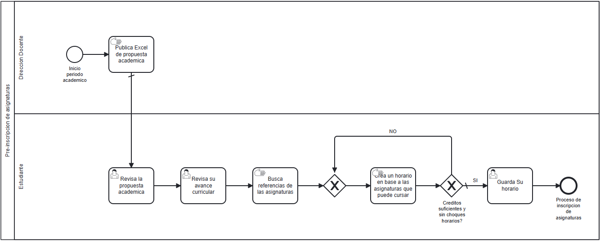

# Proceso de negocio — AS-IS

## Macro-proceso y proceso específico
Gestión Académica y Curricular → Preinscripción y Planificación Horaria de Asignaturas

## Objetivo de negocio del proceso
Permitir que la institución publique la oferta académica semestral para que el cuerpo estudiantil arme su planificación horaria previa y se inscriba formalmente en los cursos requeridos.

## Participantes y sus objetivos
| Participante | Objetivo en el proceso |
|---------------|------------------------|
| Dirección Docente / Universidad | Publicar la oferta académica semestral y garantizar el correcto registro de asignaturas por estudiante. |
| Estudiante | Planificar un horario semestral válido (sin topes horarios ni excesos de créditos) y concretar la inscripción de sus asignaturas. |

## Diagrama AS-IS

Archivo fuente: [`./diagramas/as-is.bpmn`](./diagramas/as-is.bpmn)

### Descripción de Tareas en el Modelo BPMN
- **Publicar archivo Excel con oferta académica** (*Manual Task*): La Dirección Docente consolida manualmente secciones, cupos, horarios y créditos en una planilla estática e informa su descarga vía portal web.
- **Descargar oferta en Excel** (*User Task*): El estudiante accede al portal y descarga el archivo a su dispositivo personal.
- **Revisar malla curricular estática** (*User Task*): El estudiante consulta la plataforma interactiva actual, la cual posee una magnitud limitada y solo despliega la asignatura antecedente y consecuente inmediata.
- **Buscar referencias de docentes y materias** (*Manual Task*): El estudiante consulta fuentes informales externas (foros, grupos de chat, boca a boca) para conocer el nivel de dificultad y metodología de los profesores.
- **Calcular créditos y detectar choques de horario** (*Manual Task*): El estudiante arma en papel o en una hoja de cálculo personal combinaciones de horarios, calculando la suma de créditos y verificando a mano que no existan topes horaria ni sobrecargas.
- **Ingresar asignaturas en sistema web** (*User Task*): Llegada la fecha y hora oficial de inscripción, el estudiante digita o selecciona las asignaturas preparadas en la plataforma universitaria.
- **Validar reglas de inscripción y confirmar** (*Service Task*): El sistema verifica disponibilidad de cupos, prerrequisitos directos y límites crediticios, guardando la inscripción final en la base de datos.

## Problemas identificados
- **Formato de datos arcaico y manual (Dirección Docente / Estudiante):** El uso de planillas Excel desarticuladas obliga al estudiante a procesar datos de manera artesanal, lo cual incrementa exponencialmente la probabilidad de cometer errores en la cuenta de créditos y en la identificación de choques horarias.
- **Falta de visibilidad curricular global (Estudiante):** La malla actual solo muestra las relaciones en un orden de magnitud (nodo anterior y siguiente), impidiendo que el estudiante evalúe el impacto real de desaprobar o postergar un ramo en el tiempo mínimo de titulación.
- **Información opaca e informal sobre la carga docente (Estudiante):** Inexistencia de un canal institucional o repositorio centralizado donde se valore la dificultad real y la percepción docente, forzando la toma de decisiones basada en rumores de pasillo.
- **Ineficiencia en tiempos de preparación:** El estudiante invierte largas jornadas semanales en armar combinaciones de horario de forma iterativa y manual.

Archivo fuente: [`./diagramas/as-is.bpmn`](./diagramas/as-is.bpmn)