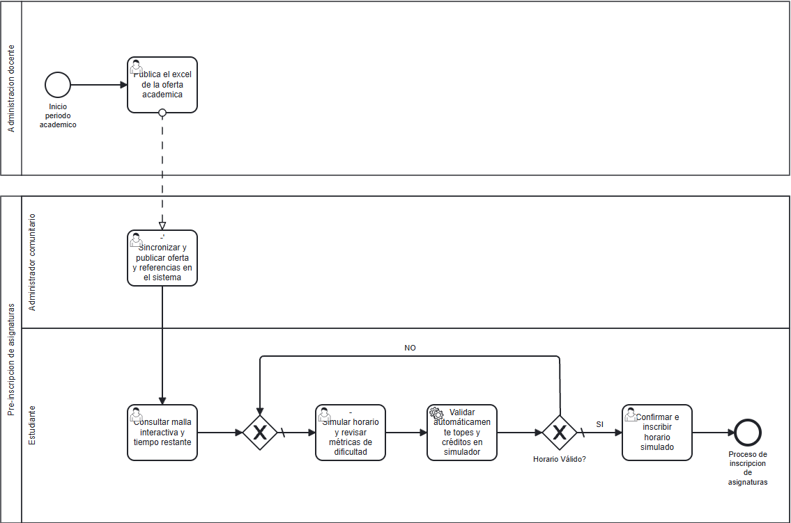

# Análisis de rediseño y propuesta TO-BE

## Mejoras identificadas por participante

| Participante | Objetivo | Problema | Mejora deseada |
|----------------|----------|----------|-----------------|
| Dirección Docente / Universidad | Difundir la oferta académica semestral. | La publicación mediante archivos Excel heterogéneos obliga al procesamiento manual y genera errores de consulta. | La oferta sigue publicándose mediante archivos Excel, pero la comunidad cuenta con una herramienta independiente para traducirlos e ingestar sus datos en la web. |
| Estudiante | Planificar un horario semestral válido y tomar decisiones informadas. | Proceso manual propenso a topes de hora/créditos, malla estática limitada a 1er grado y falta de datos de profesores/dificultad. | Módulo traductor de Excel a formato web, simulador interactivo de horarios, malla multinivel con cadena crítica, tiempo estimado de egreso y métricas de dificultad docente. |

## Iniciativas de rediseño

### Iniciativa 1: Procesador y Traductor Independiente de Oferta Académica (Excel a JSON)
- **Actividad(es) del AS-IS que afecta:** Publica Excel de propuesta académica / Revisa la propuesta académica.
- **Heurística aplicada:** *Task Automation*, *Integral Technology* & *Control Relocation*.
- **Objetivo o mejora que resuelve:** Permitir la carga del archivo `.xlsx` o `.csv` publicado por la universidad e interpretarlo mediante un algoritmo de parseo client-side/servidor comunitario, transformando tablas estáticas heterogéneas en una estructura JSON estandarizada.
- **Efecto esperado:** Eliminación del procesamiento manual de horarios por parte del alumno y disponibilidad inmediata de la oferta traducida para el simulador sin requerir una API oficial de la universidad.

### Iniciativa 2: Diseñador Interactivo de Horarios y Evaluación Docente
- **Actividad(es) del AS-IS que afecta:** Busca referencias de las asignaturas / Crea un horario en base a las asignaturas que puede cursar.
- **Heurística aplicada:** *Task Composition* & *Empower*.
- **Objetivo o mejora que resuelve:** Unificar en una sola interfaz interactiva la selección visual de secciones cargadas desde el Excel traducido, la comprobación de dificultad/profesores y la validación inmediata de choques horarios y créditos.
- **Efecto esperado:** Reducción a cero de errores de sobrecarga o topes horarios, optimizando el tiempo de planificación del estudiante.

### Iniciativa 3: Malla Interactiva de Cadena Crítica y Calculadora de Tiempo de Egreso
- **Actividad(es) del AS-IS que afecta:** Revisa su avance curricular.
- **Heurística aplicada:** *Control Relocation* / *Informational Integration*.
- **Objetivo o mejora que resuelve:** Evolucionar la malla estática de 1er grado a un grafo dinámico que despliegue todos los prerrequisitos/correquisitos en cadena y estime el tiempo mínimo real restante de carrera.
- **Efecto esperado:** Mayor visibilidad estratégica para la toma de decisiones sobre qué ramos priorizar o botar semestralmente.

## Diagrama TO-BE

Archivo fuente: [`./diagramas/to-be.bpmn`](./diagramas/to-be.bpmn)

## Actividades que cambian del AS-IS al TO-BE

| Actividad en el AS-IS | Actividad en el TO-BE | Qué cambia |
|-------------------------|--------------------------|------------|
| Publica Excel de propuesta académica | Sincronizar y publicar oferta y referencias en el sistema | La lectura manual del Excel estático es sustituida por un procesador/traductor que extrae asignaturas, secciones y bloques horarios a una estructura web reutilizable. |
| Revisa su avance curricular | Consultar malla interactiva y tiempo restante | Pasa de un gráfico estático de 1er grado a un grafo multinivel con cálculo dinámico de semestres restantes para la titulación. |
| Busca referencias de las asignaturas | Simular horario y revisar métricas de dificultad | La búsqueda informal externa se reemplaza por métricas de dificultad y desempeño docente integradas comunitariamente en el simulador. |
| Crea un horario en base a las asignaturas que puede cursar | Validar automáticamente topes y créditos en simulador | El cálculo manual en papel/Excel es sustituido por una grilla interactiva que detecta e impide cruces horarias y excesos en tiempo real sobre la oferta traducida. |
| Guarda su horario | Confirmar e inscribir horario simulado | Se permite almacenar o exportar la combinación óptima validada para el proceso de inscripción formal. |